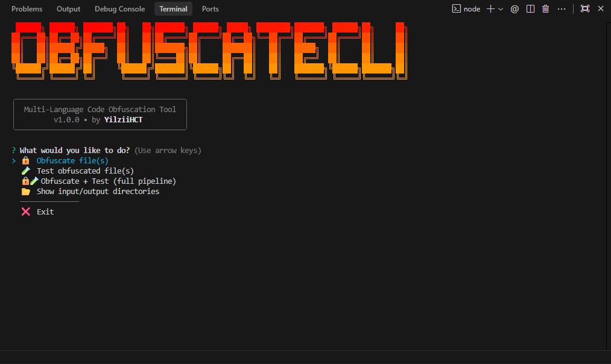

<div align="center">
<pre>
  ██████╗ ██████╗ ███████╗██╗   ██╗███████╗ ██████╗ █████╗ ████████╗███████╗
 ██╔═══██╗██╔══██╗██╔════╝██║   ██║██╔════╝██╔════╝██╔══██╗╚══██╔══╝██╔════╝
 ██║   ██║██████╔╝█████╗  ██║   ██║███████╗██║     ███████║   ██║   █████╗
 ██║   ██║██╔══██╗██╔══╝  ██║   ██║╚════██║██║     ██╔══██║   ██║   ██╔══╝
 ╚██████╔╝██████╔╝██║     ╚██████╔╝███████║╚██████╗██║  ██║   ██║   ███████╗
  ╚═════╝ ╚═════╝ ╚═╝      ╚═════╝ ╚══════╝ ╚═════╝╚═╝  ╚═╝   ╚═╝   ╚══════╝
                            ██████╗██╗     ██╗
                           ██╔════╝██║     ██║
                           ██║     ██║     ██║
                           ██║     ██║     ██║
                           ╚██████╗███████╗██║
                            ╚═════╝╚══════╝╚═╝
</pre>

<h1>ObfuscateCLI</h1>


<br><br>

[](https://opensource.org/licenses/MIT)
[](https://nodejs.org/)
[](https://github.com/YilziiHCT/obfuscate-cli)
[](https://github.com/YilziiHCT/obfuscate-cli/issues)

<br>
<b>A powerful, multi-language code obfuscation CLI tool with built-in security testing, entropy analysis, and comprehensive reporting.</b>
<br>

</div>

---

## 🔥 About

ObfuscateCLI is a production-ready command-line tool that protects your source code across multiple programming languages. It provides three levels of obfuscation — from simple minification to military-grade protection with RC4 encryption, dead code injection, and anti-tamper mechanisms.

Unlike simple minifiers, ObfuscateCLI includes a complete security testing suite that validates the strength of your obfuscation. After processing, it runs functionality tests (ensuring your code still works), decodability tests (measuring resistance to reverse engineering), static analysis (detecting leaked identifiers), and entropy analysis (measuring information density).

The interactive terminal interface makes it easy to select files, choose protection levels, and review detailed reports — all without leaving your terminal.

---

## ✨ Features

- 🔒 **Multi-Language Obfuscation** — JavaScript, PHP, HTML, CSS, Python
- 📊 **Three Protection Levels** — Light, Medium, Heavy
- 🧪 **Built-in Security Testing** — Functionality, decodability, static analysis, entropy
- 📈 **Entropy Analysis** — Shannon entropy with ASCII bar charts
- 📋 **Detailed Reports** — Terminal display + saved text reports
- 🎨 **Beautiful Terminal UI** — Gradient banners, spinners, colored tables
- ⚡ **Full Pipeline Mode** — Obfuscate + Test in one command
- 🔐 **RC4 String Encryption** — Military-grade string protection (Heavy mode)
- 💀 **Dead Code Injection** — Confuse reverse engineers with fake code paths
- 🛡️ **Self-Defending Code** — Anti-debugging & anti-tampering (JS Heavy mode)
- 📂 **Simple Workflow** — Drop files in `input-files/`, run CLI, get results

---

## 📋 Requirements

- **Node.js** v18.0.0 or higher
- **npm** v8.0.0 or higher
- **Python** (optional, for Python functionality tests)
- **PHP** (optional, for PHP syntax validation)

---

## 🚀 Installation

### Automated Setup

You can use the provided setup script for an automated installation:

```bash
curl -O https://raw.githubusercontent.com/YilziiHCT/obfuscate-cli/main/install.sh && bash install.sh
```

### Manual Setup

```bash
# Clone the repository
git clone https://github.com/YilziiHCT/obfuscate-cli.git

# Navigate to the project directory
cd obfuscate-cli

# Install dependencies
npm install

# Make executables
chmod +x bin/cli.js
chmod +x optimize.sh

# Run the tool
npm start
```

### 🛠️ Optimization

A built-in script is provided to help you optimize the environment, clean caches, and reinstall dependencies quickly if anything breaks:

```bash
bash optimize.sh
```

### Global Installation

```bash
# Install globally from local directory
npm install -g .

# Now you can run it from anywhere
obfuscate-cli
```

---

## 📖 Usage

### Quick Start

1. **Place your files** in the `input-files/` directory (or use the included examples)
2. **Run the CLI**: `npm start` or `node bin/cli.js`
3. **Select an action** from the interactive menu
4. **Choose files** to process (multi-select supported)
5. **Pick a protection level** (Light / Medium / Heavy)
6. **View results** — obfuscated files are saved to `obfuscated/`

### Menu Options

| Option | Description |
|--------|-------------|
| 🔒 Obfuscate file(s) | Select and obfuscate source files |
| 🧪 Test obfuscated file(s) | Run security tests on processed files |
| 🔒🧪 Obfuscate + Test | Full pipeline — process and validate |
| 📂 Show directories | View input/output folder paths and contents |
| ❌ Exit | Close the application |

### Output Files

Obfuscated files are saved with the `.obf` suffix:
- `app.js` → `app.obf.js`
- `index.html` → `index.obf.html`
- `style.css` → `style.obf.css`

Test reports are saved as:
- `obfuscated/report-app.txt`

---

## 🌐 Supported Languages

| Language | Extensions | Obfuscation Engine |
|----------|------------|-------------------|
| JavaScript | `.js` | javascript-obfuscator + Terser |
| PHP | `.php` | Custom AST (base64/eval chain + variable scramble) |
| HTML | `.html`, `.htm` | html-minifier-terser + inline JS/CSS obfuscation |
| CSS | `.css` | Custom minifier + unicode encoding |
| Python | `.py` | Custom renamer + string encoder + exec wrapper |

---

## 🔐 Obfuscation Levels

| Level | Techniques | Size Impact | Best For |
|-------|-----------|-------------|----------|
| **Light** | Variable renaming, comment removal, minification | −30% to −60% | Production builds, basic protection |
| **Medium** | String encoding, function/class renaming, control flow flattening, unicode escape | +50% to +150% | Commercial code, moderate protection |
| **Heavy** | RC4 encryption, dead code injection, self-defending code, debug protection, anti-tamper | +200% to +500% | Sensitive code, maximum protection |

---

## 🧪 Security Testing

ObfuscateCLI includes four comprehensive security tests:

### 1. Functionality Test
Runs the obfuscated code and compares output with the original to ensure behavior is preserved.
- **JS**: Executes via Node.js and compares stdout
- **Python**: Executes via Python interpreter and compares stdout
- **PHP**: Validates syntax with `php -l`
- **HTML**: Validates document structure
- **CSS**: Checks brace balance and syntax

### 2. Decodability Test
Attempts to reverse the obfuscation using common tools:
- **JS**: Runs js-beautify, checks readability score
- **PHP**: Detects base64/eval chain depth
- **Python**: Checks exec/b64decode layers
- **HTML/CSS**: Checks encoding strength

Scoring: 0–100 with labels: `WEAK` / `MODERATE` / `STRONG` / `UNBREAKABLE`

### 3. Static Analysis
- Detects if original string literals are still visible
- Checks if original variable/function/class names leaked
- Identifies easily reversible encoding patterns
- Reports risk level: `LOW` / `MODERATE` / `HIGH`

### 4. Entropy Analysis
- Calculates Shannon entropy (bits/byte) for original and obfuscated files
- Higher entropy = harder to read/reverse
- Displays ASCII bar chart comparison in terminal
- Labels: `VERY LOW` / `LOW` / `MEDIUM` / `HIGH` / `VERY HIGH`

---

## 📊 Example Report Output

```
┌─────────────────────────────────────────────────────────────┐
│  OBFUSCATION REPORT — app.obf.js                            │
├──────────────────┬──────────────────────────────────────────┤
│ Language         │ JavaScript                               │
│ Level            │ Heavy                                    │
│ Original Size    │ 4.2 KB                                   │
│ Obfuscated Size  │ 18.7 KB                                  │
│ Size Change      │ +345% (dead code injected)               │
│ Entropy Before   │ 4.21 bits/byte                           │
│ Entropy After    │ 6.87 bits/byte ████████████░░ HIGH       │
├──────────────────┼──────────────────────────────────────────┤
│ Functionality    │ ✅ PASS — output identical               │
│ Decodability     │ 🔒 STRONG (score: 82/100)                │
│ String Leakage   │ ✅ No original strings found             │
│ Var Name Leakage │ ✅ All variables renamed                  │
│ Reverse Risk     │ 🟡 MODERATE — hex encoding detectable    │
└──────────────────┴──────────────────────────────────────────┘
```

---

## 📁 Project Structure

```
obfuscate-cli/
├── bin/
│   └── cli.js                  ← CLI entry point
├── src/
│   ├── index.js                ← Main menu & controller
│   ├── obfuscators/
│   │   ├── js.js               ← JavaScript obfuscator
│   │   ├── php.js              ← PHP obfuscator
│   │   ├── html.js             ← HTML & CSS obfuscator
│   │   └── python.js           ← Python obfuscator
│   ├── tester/
│   │   ├── security.js         ← Security & decodability tests
│   │   ├── functional.js       ← Functionality test runner
│   │   └── entropy.js          ← Entropy calculator
│   └── utils/
│       ├── summary.js          ← Print result summaries
│       ├── reporter.js         ← Generate report files
│       └── helpers.js          ← Shared utility functions
├── input-files/                ← Place source files here
│   └── .gitkeep
├── obfuscated/                 ← Output directory
│   └── .gitkeep
├── examples/                   ← Sample files for testing
│   ├── sample.js
│   ├── sample.php
│   ├── sample.html
│   ├── sample.css
│   └── sample.py
├── README.md
├── LICENSE
└── package.json
```

---

## 🤝 Contributing

Contributions are welcome! Here's how to get started:

1. **Fork** the repository
2. **Create** a feature branch: `git checkout -b feature/amazing-feature`
3. **Commit** your changes: `git commit -m 'Add amazing feature'`
4. **Push** to the branch: `git push origin feature/amazing-feature`
5. **Open** a Pull Request

### Development Guidelines

- Write clean, well-commented code
- Follow existing code style and patterns
- Add error handling for edge cases
- Test with all supported file types
- Update documentation if adding features

### Ideas for Contributions

- Add support for new languages (TypeScript, Ruby, Go, etc.)
- Improve decodability testing algorithms
- Add config file support (`.obfuscaterc`)
- Create a web-based UI wrapper
- Add parallel processing for large batches

---

## 📄 License

This project is licensed under the **MIT License** — see the [LICENSE](LICENSE) file for details.

Copyright © 2025 [YilziiHCT](https://github.com/YilziiHCT)

---

<p align="center">
  <b>Made with ❤️ by <a href="https://github.com/YilziiHCT">YilziiHCT</a></b><br><br>
  ⭐ Star this repo if you find it useful!
</p>
